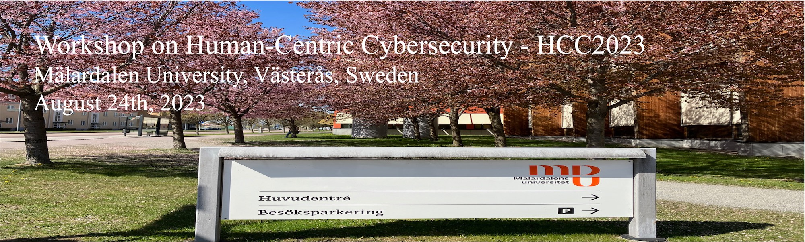

<!--
<meta charset="utf-8">
<meta http-equiv="refresh" content="0; URL=https://HCC2023.github.io/{{ https://zmoez.github.io/HCC2023.github.io/ }}">
<meta http-equiv="refresh" content="0; URL=https://HCC2023.github.io">
-->

<!--

-->

<!--  -->

<!--
# HCC2023

**Workshop on Human Centric Cybersecurity HCC2023**

**[Mälardalen University](https://www.mdu.se/en/malardalen-university), Västerås, Sweden**

**August 24th, 2023**
-->

## About
We are organizing the workshop on human-centric cybersecurity to use the knowledge and experience of the experts in the field and to strengthen our knowledge on human-centric research. 
We have invited experts in the field from all over the world to give the invited talks.

## Invited Speakers
<!-- FIXME Check the links -->

**[Jonas Stier](https://www.mdu.se/staff?id=jsr03), Mälardalen University, Sweden**

**[Simon Parkin](https://www.tudelft.nl/staff/s.e.parkin/?cHash=ef8a6923cb175152ae46a2749ee95259), TU Delft, Netherlands** 

**[Gabriele Lenzini](https://irisc-lab.uni.lu/gabriele-lenzini/), University of Luxembourg, Luxembourg**

**[Paolo Masci](https://www.nianet.org/directory/research-staff/paolo-masci/), NASA Langley Research Center, USA**

## Invited Talks

<h3>Jonas Stier</h3>
<b>Bio</b>: Jonas is a professor of social work at Mälardalen University. His research revolves around issues related to identity, discourses, participation, diversity, intercultural interaction, knowledge production and societal changes (e.g. migration and digitization) - and their consequences for people, groups, organizations and society in general. He is also one of the initiators of addai.org - a policy initiative linked to artificial intelligence.
  
  
<h3>Simon Parkin</h3> 
<b>Title: Refining the Blunt Instruments of Cyber-Risk Management</b>
    

<b>Abstract</b>: Well-meaning cybersecurity risk owners will deploy controls and countermeasures in an effort to manage the risks they see affecting their services or systems. These controls and countermeasures may produce unintended, negative harms themselves, adversely affecting user behaviour, user inclusion, or the infrastructure itself. Here I will first describe a framework for exploring the potential unintended harms of security and privacy controls, informed by a range of case studies. I will then describe subsequent work to explore how existing cyber-risk management approaches can be adapted to be less ‘blunt’ and more precise, to preserve legitimate behaviours while preventing malicious behaviours within a managed system. This leads to consideration of challenges in securing a system against identifiable risks, while ensuring that it is usable - and ultimately, accessible - for intended users.
    
<b>Bio</b>: Simon is an Assistant Professor in the Cybersecurity group in the Technology, Policy, and Management (TPM) faculty at the Delft University of Technology (TU Delft, Netherlands). His specialization is in human-centred security: usability and perceptions of security-related technologies, security behaviour change, security economics, and decision-making in security technology management, support, and policy. Current research includes: examining how best to position security and remediation support for users of consumer IoT devices; practitioner experiences and decisions in patching of IT systems in complex organizations, and; multi-stakeholder perspectives on the management of employee-facing security in organizations.
  
  
<h3>Gabriele Lenzini</h3>
<b>Title: Sociotechnical Cybersecurity: an overview, with reference to end-to-end encryption and threat intelligence</b>
    
 
<b>Abstract</b>: On this talk I will give an overview of the research on sociotechnical security taking from my personal experience in running an international workshop on the subject (STAST). I will then move to explain how today sociotechnical security applies in the forthcoming topic of cybersecurity, and I will share thoughts and some insights from my on research on combining formal modelling of secure solutions with insights coming from research investigation on user experience in security. I will refer to two particular use cases: end-to-end encryption and secure cyber threats data sharing.
    
<b>Bio</b>: Lenzini Gabriele, holds a PhD in Computer Security from the University of Twente, in the Netherlands. He is Associate Professor at the University of Luxembourg (UL), and head of the Sociotechnical Cybersecurity research group at the UL’s center for Security Reliability and Trust (SnT).
Lenzini’s research stems from formal approach to modelling and analysis of security solutions but extends to situations where the design or the analysis of security solutions intertwine with human and social aspects. Thus, it also explores questions regarding how security related with users as individuals (usability and user experience) or as collective (people’s trust depending on properties like fairness and transparency). Lenzini is UL member in Informatics Europe, ECSO, and the IFIP WG on Human Aspects of Information Security and Assurance. He is vice-chairs of the UL Ethical Review Board.
  
  
<h4>Paolo Masci</h4>
  

  

 

<!--

#### [Simon Parkin](https://www.tudelft.nl/staff/s.e.parkin/?cHash=ef8a6923cb175152ae46a2749ee95259), TU Delft 
**Title:** TBA

  

**Abstract:** TBA

**Bio:** TBA

#### [Gabriele Lenzini](), University of Luxembourg
**Title:** TBA

  

**Abstract:** TBA

**Bio:** TBA

#### [Paolo Masci](https://www.nianet.org/directory/research-staff/paolo-masci/),Research Scientist and Principal AssociateFrom NASA Langley Research Center
**Title:** TBA

  

**Abstract:** TBA

**Bio:** TBA

-->

## Schedule
TBA

## Place
<!-- FIXME Insert teams link -->
**Milos** conference room, Second floor of R building, MDU, Västerås. 

Please note that this is a hybrid event and you can also follow online, but a reliable connection is not guaranteed.

## Organizers:
[Marjan Sirjani](http://www.es.mdu.se/staff/3242-Marjan_Sirjani)

[Kristina Lundqvist](http://www.es.mdu.se/staff/180-Kristina_Lundqvist)

[Cristina Seceleanu](http://www.es.mdu.se/staff/173-Cristina_Seceleanu)

[Zahra Moezkarimi](https://www.mdu.se/staff?id=zmi01)

## Contact Info
Marjan Sirjani

Email: marjan.sirjani@mdu.se

Room: U1-066C

Phone: +46736620517

